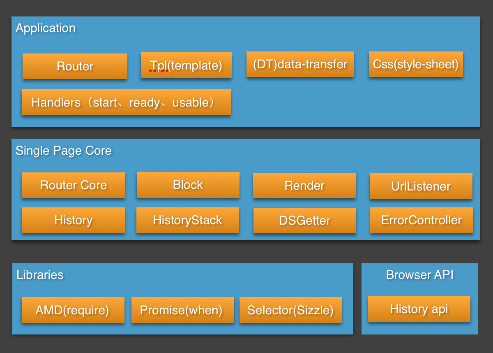

wowspg
==========

#关于wowspg

## wow单页系统简介
wow单页系统可以帮助开发者快速搭建一套前端单页面应用，wow框架主要包含：

* wowspg —— 前端Javascript单页面框架，单页面应用前端基础库
* wowui —— 前端基础样式库
* wowbuilder —— 单页面框架自动化编译工具，前端人员可以按照传统方式进行开发，由wowbuilder编译成为单页面，同时支持打包、压缩、本地测试等前端开发相关工具
* wowstyleguide —— wow框架代码开发规范

## wow基础架构
wowspg作为wow系统js基础库，可以脱离wow系统单独运行，支持开发者通过前端路由配置来实现PC端和wise端浏览器单页面应用。wowspg源码使用TypeScript进行编写，基于AMD规范编译产出js文件至output目录。

